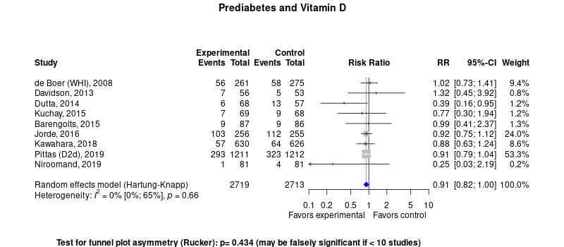

Prediabetes treatment with vitamin D
============================================
A living systematic review

Short url: https://openmetaanalysis.github.io/prediabetes

**Clinical summary:** This meta-analysis suggests that clinical intervention *is or is not* effective. Heterogeneity of results as measured by I2 was '[moderate](http://handbook-5-1.cochrane.org/chapter_9/9_5_2_identifying_and_measuring_heterogeneity.htm)' at XX%. This review updates previously published meta-analysis(es).(citation[s] below)

Meta-regression of common modulators (year of publication, study size, event rate in the control groups) finds that the outcome of the intervention is effected by xx.
* [Reconciliation of conclusions with prior meta-analyses](files/reconciliation-tables/Reconciliation%20of%20conclusions.pdf) (under construction)
<!--
* [Keep current with this topic](files/searching/Keep-up.md) (under construction)
-->
Acknowledgement: we acknowledge the essential work by the authors of the prior [systematic review(s)](#systematic-reviews) listed below.

**Methods overview:** This repository is an [openMetaAnalysis](https://openmetaanalysis.github.io/) that combines methods of scoping, rapid, and living systematic reviews.  This analysis updates one or more previously published review(s) below. A comparison of studies included in this review compared to prior reviews are in the table, [reconciliation of trials included with prior meta-analyses/](files/reconciliation-tables/Reconciliation%20of%20studies.pdf). Newer studies included are listed in the references below. Rationale for newer trials excluded may be listed at the end of the references. 
* [Methods](http://openmetaanalysis.github.io/methods.html) for openMetaAnalysis
* [Evidence search](files/searching/evidence-search.md) for this review

**Results:** Details of the studies included are in the:
* [Reconciliation of trials included with prior meta-analyses/](files/reconciliation-tables/Reconciliation%20of%20studies.pdf)
<!--* [Description of studies (PICO table)](files/study-details/table-pico.pdf) (under construction)
* [Risk of bias assessment](files/study-details/table-bias.pdf) (under construction)-->
* [Forest plots](../master/files/forest-plots) ([spreadsheets with source data](files/data))
<!--* [Network plots](../master/files/network) (optional)
* [Reconciliation of conclusions with prior meta-analyses](files/reconciliation-tables/Reconciliation%20of%20conclusions.pdf) (under construction)-->

The forest plot for the primary outcomes are below. Additional [forest plots](files/forest-plots) of secondary analyses may be available. 

The meta-regression for the primary outcomes are below. Additional [meta-regressions](files/metaregression) of secondary analyses may be available. 

<!--
The GRADE Profile is below. 
-->
References:
----------------------------------

### Systematic review(s)
#### Most recent review at time of last revision of this repository
1. Kahwati LC, LeBlanc E, Weber RP, Giger K, Clark R, Suvada K, Guisinger A, Viswanathan M. Screening for Vitamin D Deficiency in Adults: Updated Evidence Report and Systematic Review for the US Preventive Services Task Force. JAMA. 2021 Apr 13;325(14):1443-1463. doi: 10.1001/jama.2020.26498. PMID: [33847712](http://pubmed.gov/33847712) * Did not limit to patients with prediabetes* 
2. Barbarawi M, Zayed Y, Barbarawi O, Bala A, Alabdouh A, Gakhal I, Rizk F, Alkasasbeh M, Bachuwa G, Manson JE. Effect of Vitamin D Supplementation on the Incidence of Diabetes Mellitus. J Clin Endocrinol Metab. 2020 Aug 1;105(8):dgaa335. doi: 10.1210/clinem/dgaa335. PMID: [32491181](http://pubmed.gov/32491181).
3. Zhang Y, Tan H, Tang J, Li J, Chong W, Hai Y, Feng Y, Lunsford LD, Xu P, Jia D, Fang F. Effects of Vitamin D Supplementation on Prevention of Type 2 Diabetes in Patients With Prediabetes: A Systematic Review and Meta-analysis. Diabetes Care. 2020 Jul;43(7):1650-1658. doi: 10.2337/dc19-1708. PMID: [33534730](http://pubmed.gov/33534730).

### Randomized controlled trials
#### New trial(s) *not* included in the most recent review above
1. Bhatt SP, Misra A, Pandey RM, Upadhyay AD, Gulati S, Singh N. Vitamin D Supplementation in Overweight/obese Asian Indian Women with Prediabetes Reduces Glycemic Measures and Truncal Subcutaneous Fat: A 78 Weeks Randomized Placebo-Controlled Trial (PREVENT-WIN Trial). Sci Rep. 2020 Jan 14;10(1):220. doi: 10.1038/s41598-019-56904-y. Erratum in: Sci Rep. 2020 Jun 12;10(1):9844. PMID: [31937856](http://pubmed.gov/31937856).

#### Trial(s) included in the review above
1. Barengolts E, Manickam B, Eisenberg Y, Akbar A, Kukreja S, Ciubotaru I. Effect Of High-Dose Vitamin D Repletion On Glycemic Control In African-American Males With Prediabetes And Hypovitaminosis D. Endocr Pract. 2015 Jun;21(6):604-12. doi: 10.4158/EP14548.OR. Epub 2015 Feb 25. PMID: [25716637](http://pubmed.gov/25716637)
2. Davidson MB, Duran P, Lee ML, Friedman TC. High-dose vitamin D supplementation in people with prediabetes and hypovitaminosis D. Diabetes Care. 2013 Feb;36(2):260-6. doi: 10.2337/dc12-1204. Epub 2012 Oct 1. PMID: 23033239; PMCID: PMC3554269.diabetes: A 1-year, open-label randomized study. Indian J Endocrinol Metab. 2015 May-Jun;19(3):387-92. doi: 10.4103/2230-8210.152783. PMID: [25932396](http://pubmed.gov/25932396)
3. de Boer IH, Tinker LF, Connelly S, Curb JD, Howard BV, Kestenbaum B, Larson JC, Manson JE, Margolis KL, Siscovick DS, Weiss NS; Women's Health Initiative Investigators. Calcium plus vitamin D supplementation and the risk of incident diabetes in the Women's Health Initiative. Diabetes Care. 2008 Apr;31(4):701-7. doi: 10.2337/dc07-1829. Epub 2008 Jan 30. PMID: [18235052](http://pubmed.gov/18235052)
4. Dutta D, Mondal SA, Choudhuri S, Maisnam I, Hasanoor Reza AH, Bhattacharya B, Chowdhury S, Mukhopadhyay S. Vitamin-D supplementation in prediabetes reduced progression to type 2 diabetes and was associated with decreased insulin resistance and systemic inflammation: an open label randomized prospective study from Eastern India. Diabetes Res Clin Pract. 2014 Mar;103(3):e18-23. doi: 10.1016/j.diabres.2013.12.044. Epub 2014 Jan 6. PMID: [24456991](http://pubmed.gov/24456991)
5. Jorde R, Sollid ST, Svartberg J, Schirmer H, Joakimsen RM, Njølstad I, Fuskevåg OM, Figenschau Y, Hutchinson MY. Vitamin D 20,000 IU per Week for Five Years Does Not Prevent Progression From Prediabetes to Diabetes. J Clin Endocrinol Metab. 2016 Apr;101(4):1647-55. doi: 10.1210/jc.2015-4013. Epub 2016 Feb 1. PMID: [26829443](http://pubmed.gov/3117268294433679)
6. Kawahara T, Suzuki G, Inazu T, Mizuno S, Kasagi F, Okada Y, Tanaka Y. Rationale and design of Diabetes Prevention with active Vitamin D (DPVD): a randomised, double-blind, placebo-controlled study. BMJ Open. 2016 Jul 7;6(7):e011183. doi: 10.1136/bmjopen-2016-011183. PMID: [27388357](http://pubmed.gov/27388357)
7. Kuchay MS, Laway BA, Bashir MI, Wani AI, Misgar RA, Shah ZA. Effect of Vitamin D supplementation on glycemic parameters and progression of prediabetes to 
8. Niroomand M, Fotouhi A, Irannejad N, Hosseinpanah F. Does high-dose vitamin D supplementation impact insulin resistance and risk of development of diabetes in patients with pre-diabetes? A double-blind randomized clinical trial. Diabetes Res Clin Pract. 2019 Feb;148:1-9. doi: 10.1016/j.diabres.2018.12.008. Epub 2018 Dec 21. PMID: [30583032](http://pubmed.gov/30583032)
9. Pittas AG, Dawson-Hughes B, Sheehan P, Ware JH, Knowler WC, Aroda VR, Brodsky I, Ceglia L, Chadha C, Chatterjee R, Desouza C, Dolor R, Foreyt J, Fuss P, Ghazi A, Hsia DS, Johnson KC, Kashyap SR, Kim S, LeBlanc ES, Lewis MR, Liao E, Neff LM, Nelson J, O'Neil P, Park J, Peters A, Phillips LS, Pratley R, Raskin P, Rasouli N, Robbins D, Rosen C, Vickery EM, Staten M; D2d Research Group. Vitamin D Supplementation and Prevention of Type 2 Diabetes. N Engl J Med. 2019 Aug 8;381(6):520-530. doi: 10.1056/NEJMoa1900906. Epub 2019 Jun 7. PMID: [31173679](http://pubmed.gov/31173679).

#### Trial(s) undergoing review
1. Kawahara T, Suzuki G, Mizuno S, Inazu T, Kasagi F, Kawahara C, Okada Y, Tanaka Y. Effect of active vitamin D treatment on development of type 2 diabetes: DPVD randomised controlled trial in Japanese population. BMJ. 2022 May 25;377:e066222. doi: 10.1136/bmj-2021-066222. PMID: [35613725](http://pubmed.gov/35613725).

#### Trial(s) excluded - selected list of important trial(s)
1. Bhatt SP, Misra A, Pandey RM, Upadhyay AD, Gulati S, Singh N. Vitamin D Supplementation in Overweight/obese Asian Indian Women with Prediabetes Reduces Glycemic Measures and Truncal Subcutaneous Fat: A 78 Weeks Randomized Placebo-Controlled Trial (PREVENT-WIN Trial). Sci Rep. 2020 Jan 14;10(1):220. doi: 10.1038/s41598-019-56904-y. Erratum in: Sci Rep. 2020 Jun 12;10(1):9844. PMID: [31937856](http://pubmed.gov/31937856). *We could not confidently extract diabetes outcome counts using outcomes rates provided*

#### Cited by
This repository is cited by:

1. WikiDoc contributors. Pending content page. WikiDoc. Nov 9, 2014. Available at: http://www.wikidoc.org/index.php/This_topic. Accessed November 9, 2014. 

-------------------------------
[Cite and use this content](https://github.com/openMetaAnalysis/openMetaAnalysis.github.io/blob/master/reusing.MD)  - [Edit this page](../../edit/master/README.md) - [License](files/LICENSE.md) - [History](../../commits/master/README.md)  - 
[Issues and comments](../../issues?q=is%3Aboth+is%3Aissue)

